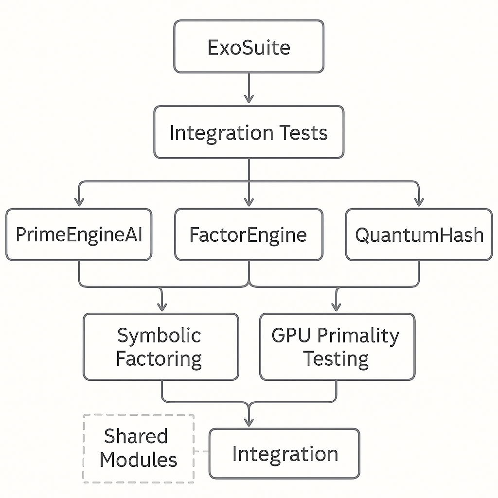

<<<<<<< HEAD




# 🧠 ExoSuite Master Stack

ExoSuite is a symbolic computation stack uniting three advanced engines:

| Engine | Description |
|--------|-------------|
| **PrimeEngineAI** | Prime discovery via symbolic filters, GPU sieving, ML scoring |
| **QuantumHash** | Post-quantum hash transformation & cryptographic hardening |
| **FactorEngine** | Symbolic + GPU factoring tool for large composite integers |

## 🔗 Integration Features
- Shared symbolic rules and exclusion layers
- Compatible REST APIs (FastAPI)
- Unified test harness (integration layer)
- Full SDLC automation via GitHub Actions
- Containerized via Docker

## 📁 Project Layout

```
ExoSuiteMaster/
├── PrimeEngineAI/
├── QuantumHash/
├── FactorEngine/
├── tests/integration/
├── docs/
└── .github/workflows/
```

## ✅ Quickstart

Each engine is standalone or orchestrated via ExoSuite:

```bash
cd PrimeEngineAI
python examples/demo_run.py
```

## 🧪 Run Tests

```bash
pytest tests/
```
=======
# ExoSuite


Welcome to ExoSuite � Symbolic Prime Discovery and Factor Intelligence Suite.
>>>>>>> 3453edc (chore(repo): full monorepo restructure, test/config updates, and CI setup)
